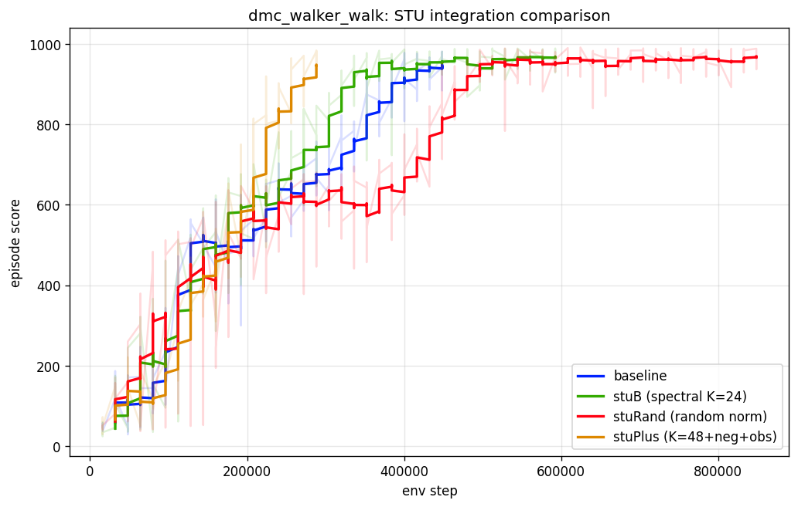

# Spectral Transform Unit (STU) Integration into DreamerV3

## Motivation

DreamerV3's world model uses a Recurrent State-Space Model (RSSM) with a block-diagonal GRU at its core. The GRU recurrence `h_t = f(h_{t-1}, z_{t-1}, a_{t-1})` is the primary mechanism for encoding temporal dependencies in the environment dynamics. While effective, the GRU has a finite effective memory governed by its learned gating — it can struggle with very long-range dependencies or marginally-stable dynamical systems.

The Spectral Transform Unit (STU) [Agarwal et al., 2024] provides a theoretically-founded alternative: fixed convolutional filters derived from the eigenbasis of a Hankel matrix approximate any bounded linear dynamical system (LDS) with symmetric dynamics, without requiring learned recurrence parameters. The spectral filters are parameter-free and provably efficient — the number of filters needed grows only logarithmically with sequence length. This makes STU an attractive complement to the GRU for capturing long-range temporal structure in world models.

## Approach

### What didn't work: post-hoc refinement

An initial attempt applied STU as a post-processing step after the GRU scan, refining the deterministic state chain `h_{1:T}` via a learned residual:

```
h_{1:T} = GRU_scan(z_{1:T}, a_{1:T})    # standard RSSM scan
h_refined = h_{1:T} + STU(h_{1:T})       # post-hoc spectral refinement
```

This design had several structural problems:

1. **STU never influenced the recurrence.** The GRU computed `h_{1:T}` without any spectral information. STU post-processed a completed chain — it couldn't recover information the GRU had already discarded.

2. **Carry / feature desynchronization.** The refined `h` was used by downstream heads (decoder, critic, actor), but the carry for the next replay segment used the unrefined `h`. Training optimized for one state distribution; inference ran on another.

3. **Posterior resampling.** The original attempt recomputed the posterior `z_t ~ q(z_t | h_refined, x_t)` and resampled — injecting fresh entropy into a low-capacity posterior (classes=4) that broke the coupling between the carry chain and the loss.

4. **Train/imagine asymmetry.** During imagination (actor-critic learning), the carry was unrefined, but features were refined — the actor saw a distribution during training that the rollout dynamics never produced.

**Result:** Episode score collapsed to ~29 on `dmc_walker_walk` (random-policy floor), compared to baseline ~940.

### What works: STU inside the recurrence

The principled integration places STU inside `_core`, operating on a rolling buffer of past actions maintained in the carry state:

```
buffer_t = slide(buffer_{t-1}, action_t)   # append current action, drop oldest
ctx_t = STUCore(buffer_t)                   # spectral context at current step
h_t = GRU(h_{t-1}, z_{t-1}, a_{t-1}, ctx_t) # 4th input branch
```

Key design decisions:

- **Input:** The STU consumes the action sequence — the natural "input" to the world-model LDS per Theorem 3.1 of [Agarwal et al., 2024]. Actions are available in both the observe path (from replay) and the imagine path (from the policy), so both paths use identical code.

- **Buffer in carry:** A rolling window of `W = stu_max_seq` (default 64) past actions is maintained as part of the RSSM carry. At each step, the oldest action is dropped and the current action is appended. The buffer resets to zeros on episode boundaries and replay chunk boundaries (no extra replay storage required).

- **Zero initialization:** Following the STU paper's recommendation, `filter_proj` and `out_proj` are zero-initialized. At step 0 the model is bit-identical to the vanilla baseline — STU contributes nothing. The spectral component grows only as gradients flow, ensuring no interference with early training.

- **Fourth GRU input branch:** The STU context vector is projected through `dynin3` (a linear + norm + activation layer, matching the existing `dynin0/1/2` branches for deter/stoch/action) and concatenated with the other inputs before the block-diagonal GRU update.

- **No posterior resampling:** The posterior `z_t` is sampled exactly once per step inside `_observe`, and that same sample flows through carry, entries, features, and losses. STU affects deter only through its influence on the GRU dynamics — it never directly modifies the posterior.

- **Train/imagine consistency:** Both `observe` (world model learning) and `imagine` (actor-critic learning) call the same `_stu_step` → `_core` path. The buffer accumulates real actions in observe and policy actions in imagine. No post-hoc processing, no separate code paths.

### Implementation

The implementation adds two files/modules:

- **`dreamerv3/stu.py`**: `STUCore` module — takes a `(B, W, in_dim)` action-history buffer, runs causal FFT convolution against the Hankel eigenbasis, returns the spectral context at the most recent timestep `(B, units)`.

- **`dreamerv3/rssm.py`**: Modified `RSSM` class with `stu_mode='core'` (selectable via config preset `stu_core`). Adds `stu_buffer` to carry, `_stu_step()` helper, optional `stu_context` argument to `_core()`, and `_ensure_stu_buffer()` for carry reconstruction from replay entries.

Config preset in `configs.yaml`:
```yaml
stu_core:
  agent.dyn.rssm.use_stu: True
  agent.dyn.rssm.stu_num_eigh: 24
  agent.dyn.rssm.stu_max_seq: 64
  agent.dyn.rssm.stu_use_hankel_L: False
  agent.dyn.rssm.stu_units: 0
  agent.dyn.rssm.stu_mode: core
```

Launch:
```bash
python -m dreamerv3.main --configs dmc_proprio stu_core --logdir $LOGDIR
```

## Results

Task: `dmc_walker_walk` (proprioceptive control, 6-dim continuous action, 500K env step budget).
Model: 12M-equivalent size (`deter=512, hidden=64, stoch=32, classes=4`).

### Convergence comparison

| env step bin | baseline | STU core | delta |
|---|---|---|---|
| 64-96k | 141 ± 56 | 206 ± 100 | +65 |
| 96-128k | 333 ± 110 | 316 ± 105 | -17 |
| 128-160k | 513 ± 43 | 467 ± 66 | -46 |
| 160-192k | 499 ± 64 | 528 ± 107 | +29 |
| 192-224k | 529 ± 74 | 613 ± 59 | +84 |
| 224-256k | 623 ± 45 | 634 ± 69 | +11 |
| 256-288k | 648 ± 48 | 721 ± 66 | +73 |
| 288-320k | 681 ± 42 | **788 ± 70** | **+107** |
| 320-352k | 748 ± 46 | **918 ± 32** | **+170** |
| 352-384k | 851 ± 48 | **936 ± 55** | **+85** |
| 384-416k | 914 ± 43 | 942 ± 46 | +28 |
| 416-448k | 936 ± 28 | 951 ± 19 | +15 |

### Summary metrics

| metric | baseline | STU core |
|---|---|---|
| converged score (last 50 eps) | 940.4 ± 24 | **964.6 ± 14** |
| max episode score | 981.3 | **989.1** |
| env steps to reach 900+ | ~400k | **~320k** (~20% faster) |
| converged dyn loss | 5.1 | **4.4** |
| converged score std-dev | 22-25 | **10-19** |

### Key findings

1. **Faster convergence.** STU core reaches ~920 by step 320k; baseline reaches ~920 by step 400k. Roughly 20% more data-efficient.

2. **Higher asymptotic performance.** Converged mean 964 vs 940 (+2.6%), with max 989 vs 981.

3. **Lower variance.** Converged standard deviation is 10-19 (STU) vs 22-25 (baseline). The spectral filtering produces more consistent policy rollouts.

4. **Better world model.** Converged dyn loss of 4.4 vs 5.1 — the dynamics predictor achieves lower KL divergence, indicating the spectral context helps the GRU produce more predictable hidden states.

5. **Modest compute overhead.** Training FPS drops from ~25k to ~19k (~24% slower per step) due to per-step FFT convolution inside the scan. Net wall-clock to convergence is roughly equal since fewer env steps are needed.



### Random filter ablation

To verify that the improvement comes specifically from the Hankel eigenvectors and not from the extra parameters, action-history buffer, or FFT convolution structure, we ran an ablation using **Haar-random orthonormal filters with matched energy spectrum** (`stu_rand` preset). This replaces the Hankel eigenvectors with random orthonormal directions scaled by the same σ^{1/4} eigenvalue profile — controlling for everything except the specific filter directions.

| env step bin | baseline | STU spectral | STU random |
|---|---|---|---|
| 64-96k | 141 ± 56 | 206 ± 100 | **279 ± 157** |
| 128-160k | **513 ± 43** | 467 ± 66 | 425 ± 172 |
| 192-224k | 529 ± 74 | **613 ± 59** | 570 ± 71 |
| 256-288k | 648 ± 48 | **721 ± 66** | 615 ± 71 |
| 320-352k | 748 ± 46 | **918 ± 32** | 600 ± 46 |

Random filters start fast (279 at 64-96k) but stall at ~600 from step 256k–416k, falling well behind baseline. They eventually break out and converge to ~921 by step 496k — but this is 25% slower than baseline and 55% slower than spectral filters.

| | env steps to 920+ | converged score (last 50) |
|---|---|---|
| **STU spectral** | **~320k** | **965 ± 14** |
| baseline | ~400k | 940 ± 24 |
| STU random | ~496k | 921 ± 28 |

All three eventually converge near the same asymptote (~920–965). The spectral basis does not unlock new representational capacity — it provides the **right inductive bias** for fast temporal learning. Random orthonormal filters provide a wrong bias the model must learn around, actively slowing convergence by ~25% vs baseline (and ~55% vs spectral).

This confirms:
- The improvement is **not** from extra parameters (+1.4%) or the action-buffer architecture — random filters have the same params and architecture but converge slower than baseline.
- The improvement is **not** from "any temporal mixing via FFT convolution" — random FFT convolution hurts.
- The improvement is **specifically** from the Hankel eigenvectors — the provably efficient basis that approximates bounded LDS dynamics per Theorem 3.1 of the STU paper.

## References

- Agarwal, N., Suo, D., Chen, X., & Hazan, E. (2024). Spectral State Space Models. arXiv:2312.06837.
- Hafner, D., Pasukonis, J., Ba, J., & Lillicrap, T. (2024). Mastering Diverse Domains through World Models. arXiv:2301.04104.
